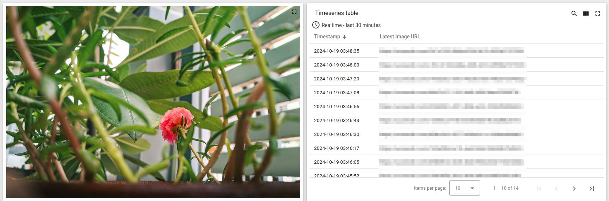
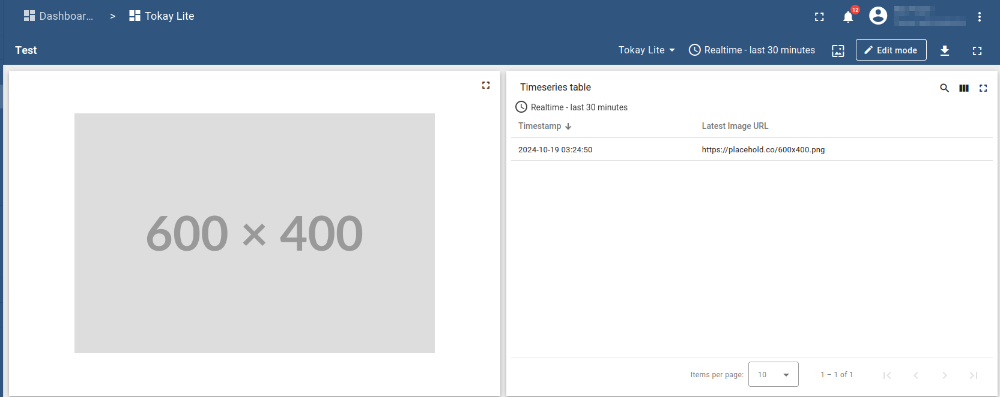

# Rust Demo Firmware For [Tokay Lite Camera](https://maxlab.io/store/edge-ai-camera/)



## Necessary Preparation

### Build Environment

The firmware is based on ESP32-IDF Rust framework. In order to install all
necessary tools, proceed with following:

```sh
cargo install espup
espup install
cargo install ldproxy
```

### Uploadcare Account

The demo firmware uses [Uploadcare](https://uploadcare.com/) cloud provider
as a means of images storage. To have your images uploaded, do following:

1. [Sign up to Uploadcare](https://app.uploadcare.com/accounts/signup/)
1. Obtain [the public API key](https://help.uploadcare.com/article/318-where-do-i-get-my-api-keys).

### ThingsBoard Initial Configuration

[ThingsBoard IoT framework](https://thingsboard.io/) is used in
the demo to display the image. No other telemetry is sent for simplicity,
but it's easy to extend the firmware to send more data if needed.

To leverage ThingsBoard in this demo, you need to do following:

1. Create a free account on [ThingsBoard demo server](https://demo.thingsboard.io).
1. Follow the [official Getting Started guide](https://thingsboard.io/docs/getting-started-guides/helloworld/#step-1-provision-device)
   to provision the device an obtain [Device Access Token](https://thingsboard.io/docs/user-guide/access-token/).
1. Add a single telemetry record for the newly created ThingsBoard device. This
   will serve as a placeholder image. You can do it either manually in
   ThingsBoard UI, or by issuing a command:

   ```sh
   mosquitto_pub -d -q 1 -h "demo.thingsboard.io" -t "v1/devices/me/telemetry" -u "$ACCESS_TOKEN" -m '{"url":"https://placehold.co/600x400.png"}'
   ```
1. Take [`doc/image_display_widget.json`](doc/image_display_widget.json)
   file and upload it to the [Widget Library](https://thingsboard.io/docs/user-guide/ui/widget-library/)
   in your ThingsBoard UI.
1. Create [IoT dashboard](https://thingsboard.io/docs/user-guide/dashboards/)
   and add "Image Display Widget" to it. Add more widgets if you want.
1. At this point your dashboard could look like this:

  

### Configure The Firmware

1. Create a configuration file based of an example:

   ```sh
   cp doc/example.cfg.toml cfg.toml
   ```

1. Modify values of `cfg.toml` according to previously obtained access keys.
   Don't forget to modify WiFi settings.

## Build Firmware

As simple as:

```sh
cargo build
```

# Upload Firmware to Device

1. Connect the camera USB-C port to PC.
1. Press hold **PWR_ON** button (**SW1**). Don't release the button until
   flashing is complete.
1. Flash the firmware:

   ```sh
   cargo run
   ```

1. Enjoy your camera uploading images every 10 seconds.

## Further Reading and References

* [Tokay AI Camera documentation page](https://docs.maxlab.io/docs/edge-ai-tokay-lite/)
* [Camera firmware written in C](https://github.com/maxlab-io/tokay-lite-pcb/tree/main)
* [Rust on ESP32 book](https://docs.esp-rs.org/book/)
* [Set of nice ESP32 camera examples](https://github.com/Kezii/esp32cam_rs)
* [Floodplain's video series on ESP32 Rust](https://www.youtube.com/watch?v=o8yNNVFzNnM&list=PL0U7YUX2VnBFbwTi96wUB1nZzPVN3HzgS)
